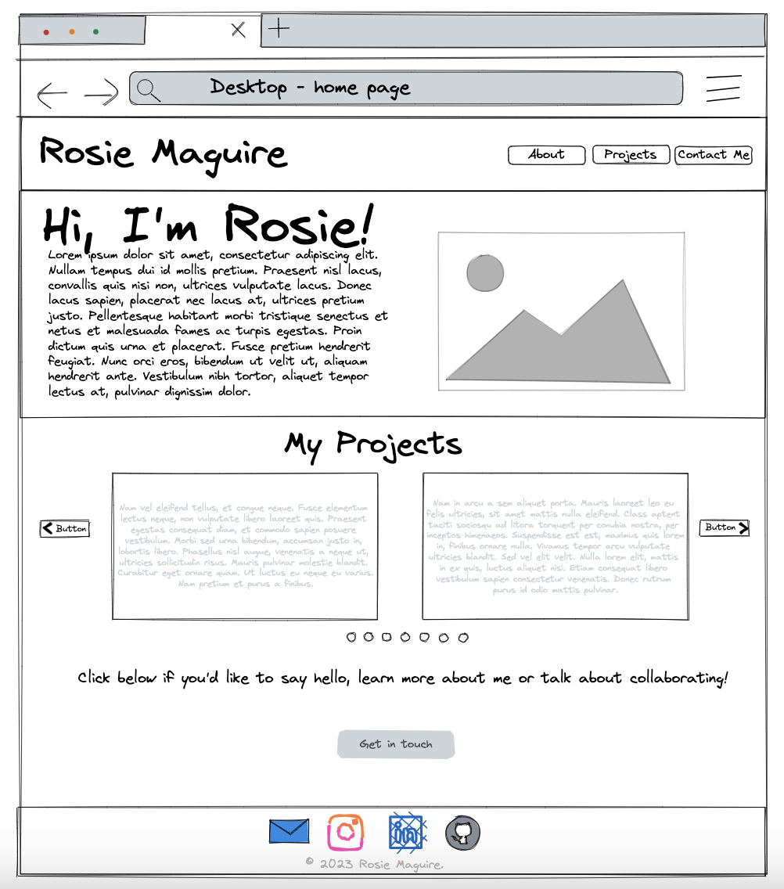
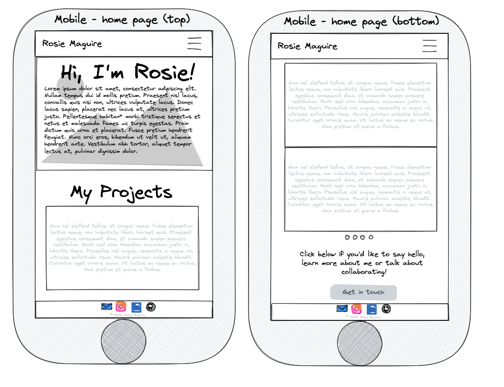
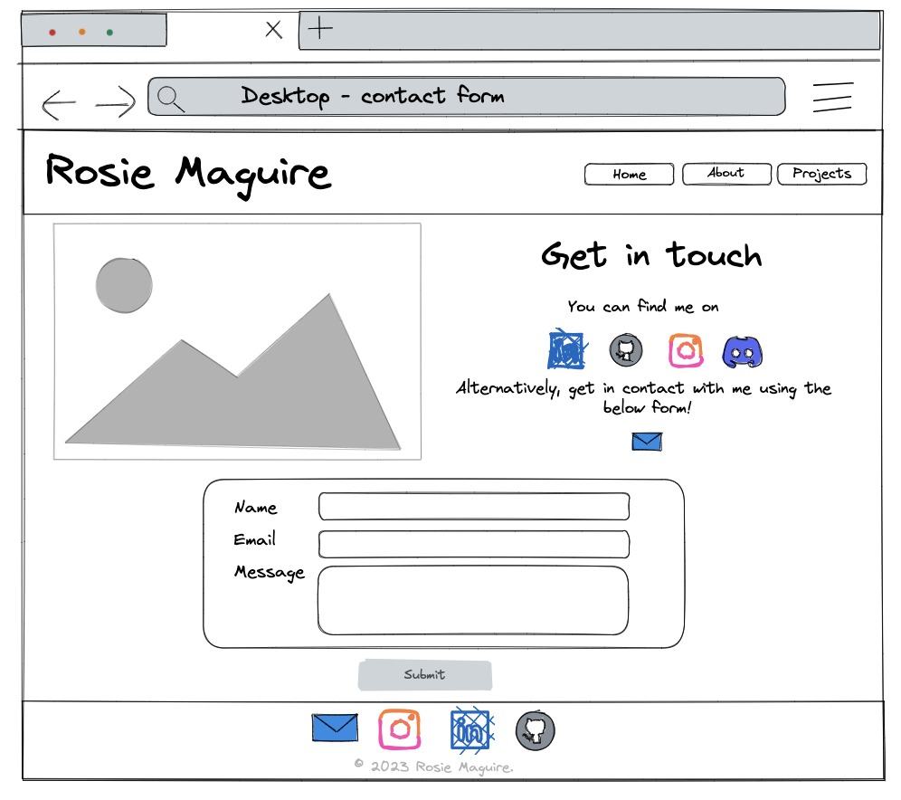
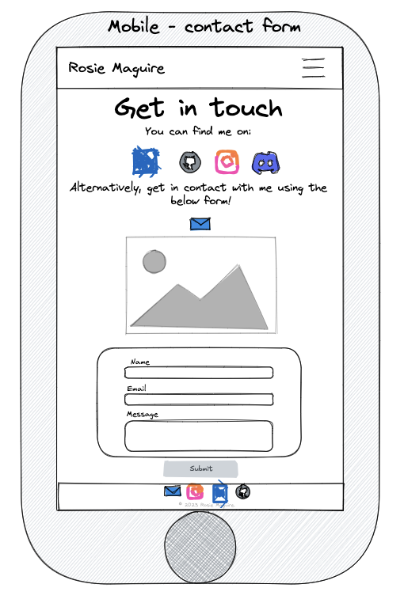

# Rosie Maguire - Portfolio Task
[My portfolio site](https://rosiemaguire.github.io/Portfolio_Project/)

## Project Requirements

### Content
This portfolio showcases several projects that I have worked on and allows me to continue adding projects, showing my professional journey. I have embedded a fully functioning contact form that allows visitors to provide me with feedback or discuss colalboration. I have also included links to my GitHub, LinkedIn, Discord Profile and Instagram. 
- [x] At least one profile picture
- [x] Biography (at least 100 words)
- [x] Functional Contact Form
- [x] "Projects" section
- [x] Links to external sites, e.g. GitHub and LinkedIn.

### Technical
I have separated my content into two responsive pages, the main index page and a contact page. I have built the pages using semantic HTML, CSS and splash of JavaScript. During the project development I have been working off a "WIP" branch and merging to main once I'm happy to publish changes.
- [x] At least 2 web pages.
- [x] Version controlled with Git
- [x] Deployed on GitHub pages.
- [x] Implements responsive design principles.
- [x] Uses semantic HTML.

### Bonus (optional)
Technical features that are worth highlighting include the responsive nav bar, embedding a video, multiple hover effects, including tool tips and making button stylings multi-browser compatible. 
- [x] Different styles for active, hover and focus states.
- [x] Include JavaScript to add some dynamic elements to your site. (Extratricky!)

### Screenshot
> Please include the following:
> - The different pages and features of your website on mobile, tablet and desktop screen sizes (multiple screenshots per page and screen size).
> - The different features of your site, e.g. if you have hover states, take a screenshot that shows that.
>

### Desktop_Home_Page_Wireframe

### Mobile_Home_Page_Wireframe

### Desktop_Contact_Form_Wireframe

### Mobile_Contact_Form_Wireframe